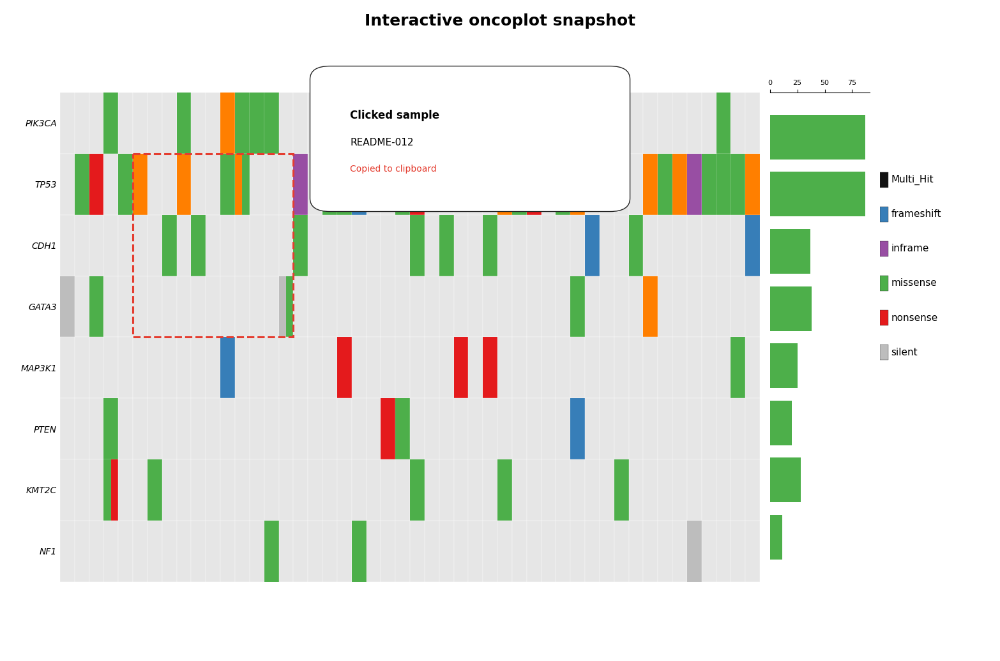
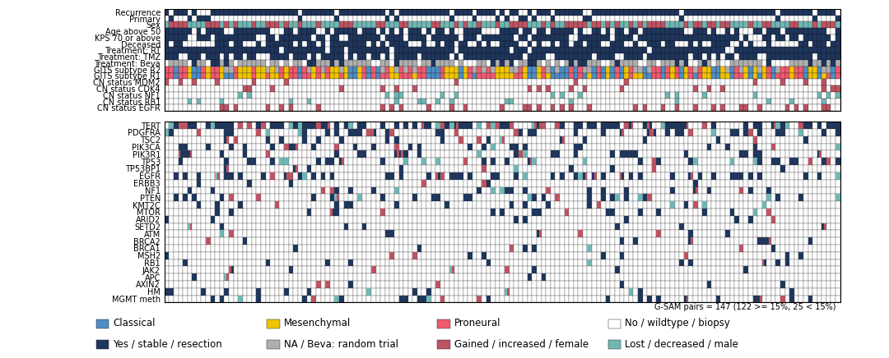

# pyoncoplot

`pyoncoplot` is a Pythonic implementation of oncoplots inspired by the
R package `ggoncoplot`. It accepts mutation-level tabular data and can render
interactive Plotly oncoplots or static Matplotlib figures.

## Documentation

Full documentation lives in [docs/index.md](docs/index.md), including:

- [quickstart examples](docs/quickstart.md)
- [input schemas](docs/data-inputs.md)
- [metadata and TMB usage](docs/metadata-and-tmb.md)
- [gallery recreation](docs/gallery.md)
- [migration notes for ggoncoplot users](docs/migration-from-ggoncoplot.md)

## Install for Development

```bash
python3 -m pip install -e ".[test,export]"
```

The `export` extra adds `kaleido` for Plotly image export. HTML export does not
need it.

## Quick Start

```python
import pandas as pd
from pyoncoplot import oncoplot

mutations = pd.DataFrame(
    {
        "sample": ["S1", "S1", "S2", "S3"],
        "gene": ["TP53", "EGFR", "TP53", "PTEN"],
        "mutation_type": [
            "Missense_Mutation",
            "Frame_Shift_Del",
            "Nonsense_Mutation",
            "Splice_Site",
        ],
    }
)

result = oncoplot(
    mutations,
    gene_col="gene",
    sample_col="sample",
    mutation_type_col="mutation_type",
    backend="plotly",
    top_n=10,
    draw_gene_bar=True,
    draw_tmb_bar=True,
)
```

In a Jupyter notebook, render the result in a cell with any of these:

```python
result.figure
```

```python
result.show()
```

```python
from IPython.display import display

display(result.figure)
```

Save the interactive Plotly result as standalone HTML:

```python
result.save("oncoplot.html")
```

Plotly backend screenshot:



Color the main grid by a continuous variant-level value, such as VAF, while
keeping mutation-type stacks in the optional gene bar:

```python
mutations["vaf"] = [0.32, 0.18, 0.61, 0.44]

result = oncoplot(
    mutations,
    gene_col="gene",
    sample_col="sample",
    mutation_type_col="mutation_type",
    variant_value_col="vaf",
    variant_value_agg="max",
    variant_value_missing="blank",
    variant_value_palette="viridis",
    draw_gene_bar=True,
    backend="plotly",
)
```

Show mutation type and multiple numeric variant values as separate rows under
each gene:

```python
result = oncoplot(
    mutations,
    gene_col="gene",
    sample_col="sample",
    mutation_type_col="mutation_type",
    main_grid_rows=[
        {"kind": "mutation_type", "label": "Variant type"},
        {"kind": "variant_value", "column": "VAF_pct", "label": "VAF %"},
        {"kind": "variant_value", "column": "VAF_abs", "label": "VAF abs", "palette": "magma", "missing": "zero"},
    ],
    gene_name_x_offset=12,
    draw_gene_bar=True,
    backend="plotly",
)
```

The same call can be made from a reusable parameter dictionary; explicit
keywords override dictionary values:

```python
params = {
    "data": mutations,
    "gene_col": "gene",
    "sample_col": "sample",
    "mutation_type_col": "mutation_type",
    "top_n": 5,
}

result = oncoplot(params=params, top_n=10)
```

When you want to keep the unpacked `**params` style and override a key that may
already be present, merge first:

```python
from pyoncoplot import merge_oncoplot_params

merged = merge_oncoplot_params(params, top_n=10)
result = oncoplot(**merged)
```

For one-off calls, `ChainMap` is also valid as long as overrides come first:

```python
from collections import ChainMap

result = oncoplot(**ChainMap({"top_n": 10}, params))
```

For a static Matplotlib backend:

```python
from IPython.display import display

result = oncoplot(
    mutations,
    gene_col="gene",
    sample_col="sample",
    mutation_type_col="mutation_type",
    backend="matplotlib",
    draw_gene_bar=True,
    draw_tmb_bar=True,
)

display(result.figure)
result.save("oncoplot.png", dpi=120)
```

Matplotlib backend screenshot:



## Recreate the Example Gallery

The reference PNGs in `python_refactor_goal_sources/goal_plots/` can be recreated with:

```bash
python3 python_refactor_goal_sources/recreate_gallery.py
```

Generated files are written to `python_refactor_goal_sources/generated_plots/clean/` as
`gen.goal_plot_01.png` through `gen.goal_plot_21.png`, ordered by source family:
ggoncoplot/R examples first, other R-based paper examples next, and Python/fuc
examples last. The original reference images remain untouched. Gallery runs are configured in
`python_refactor_goal_sources/config.yaml` under `gallery_params.plot_runs`.
The gallery uses deterministic TSV/JSON inputs stored in `python_refactor_goal_sources/syntheitic_goal_data/`.
Regenerate non-fuc synthetic fixtures with:

```bash
python3 python_refactor_goal_sources/generate_synthetic_inputs.py
```

Regenerate fuc-backed AML/SV fixtures with `python_refactor_goal_sources/fuc_sources/rebuild_fuc_fixtures.py`
after downloading the upstream fuc-data files listed in `python_refactor_goal_sources/fuc_sources/manifest.json`.
Side-by-side comparison sheets can be rendered separately:

```bash
python3 python_refactor_goal_sources/recreate_gallery.py --style comparison --preset brca_large
```

## Pythonic API

The public API intentionally uses Python names rather than preserving R names:

| R `ggoncoplot` argument | Python `pyoncoplot` argument |
| --- | --- |
| `col_genes` | `gene_col` |
| `col_samples` | `sample_col` |
| `col_mutation_type` | `mutation_type_col` |
| `col_tooltip` | `tooltip_col` |
| `genes_to_include` | `include_genes` |
| `genes_to_ignore` | `ignore_genes` |
| `topn` | `top_n` |
| `draw_gene_barplot` | `draw_gene_bar` |
| `draw_tmb_barplot` | `draw_tmb_bar` |
| `copy` | `copy_on_click` |
| `cols_to_plot_metadata` | `metadata_cols` |
| `col_samples_metadata` | `metadata_sample_col` |
| `col_genes_pathway` | `pathway_gene_col` |

## Attribution

This package ports behavior from the MIT-licensed
[`ggoncoplot`](https://github.com/selkamand/ggoncoplot) R package. The original
R implementation is retained for reference in this fork's Git history and as a
pinned submodule at `python_refactor_goal_sources/ggoncoplot`. The Python
implementation is not intended to be pixel-identical to the ggplot output, but
it follows the same core data semantics: top-gene selection, multi-hit collapse,
sample sorting, metadata handling, pathway grouping, TMB bars, and mutation
palettes.
